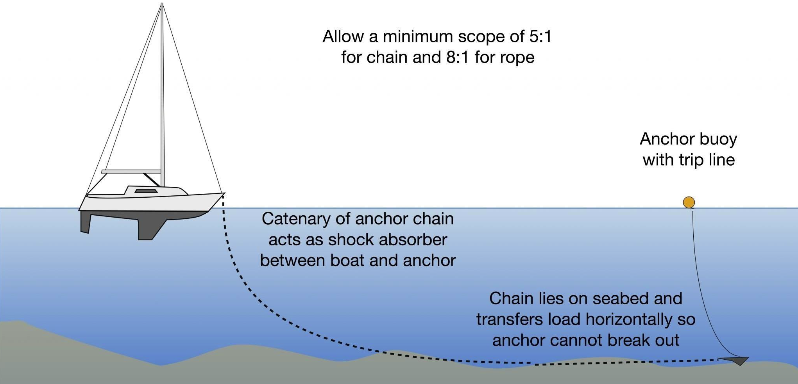

# Anchoring

If you’re working on the Chase Boat and need to anchor, you may find one in the plastic Milk Crate and it will have limited effective depth, perhaps 20 feet. For a temporary anchoring, you‘ll need about 60 feet of rode plus the chain and anchor for 3 to 1 scope. If there’s a current, choppy conditions, or strong wind you may need more scope, 5 to 1, or optimally 8:1 if there’s that much (160’ for 20’ of depth) onboard. Remember to count freeboard into depth.

Once the anchor is dropped and the boat backed up some distance, then wait until the end of the rode is reached and the anchor starts to set. Put your hand on the rode outside the boat and feel as the anchor digs in and sets. If you feel movement then your anchor is not setting and you may need more rode. I suggest paying out rode in one depth increments at a time (e.g., 20 feet for 20 foot depth) then feeling the rode to see if the anchor sets.

To take up the anchor, take in the rode pulling/motoring the boat forward until the rode is vertical. If the anchor is free then haul it in rinsing it a few times before bringing onboard. If the anchor isn’t free then run the rode around the bow cleat and take the slack out letting the bobbing of the boat break it free and once free haul it in, rinsing before bringing aboard.

If the anchor feels caught on something ease a few feet of rode and cleat it off then motor in a circle. The rotating orientation should free the flukes from whatever it’s caught on, then haul it up. The best practice is to attach a Trip Line to the crown of the anchor.
If your engine stops and will not start, lower the anchor to avoid grounding, then radio for assistance.

