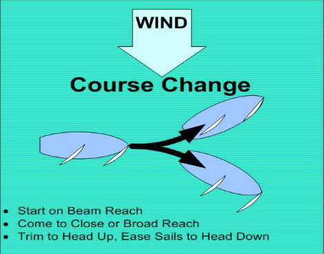

# Changing Sail Trim While Looking Ahead

The mainsheet and jib sheet are positioned directly in front of the sailor, so there is no need to look at the lines while trimming in or easing out. It is more important to look ahead to see where you are going, while glancing briefly at the sails to see the effect of the trimming.

## Practice

Start sailing on a beam reach.

Take one last look at where the jib sheet and mainsheet are located. Then without looking, try to first put your hand on the jib sheet, and then the mainsheet. Repeat this, until you are comfortable finding each line without looking.

Check your surroundings for other boats.

**Head up** to close-hauled, while pulling in the jib sheet and the mainsheet, without looking at the lines. Keep your eyes focused up and ahead to where you are going, occasionally glancing at the sails. This can be done with the joystick pushing fore or aft.

After a few minutes, **head down** to a broad reach, easing the main sheet and then the jib sheet. Keep your eyes focused ahead to where you are going.

Repeat this procedure until it feels natural to handle the sheets without looking at your hands.

