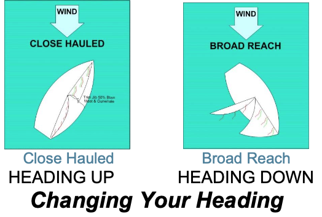

# Changing Your Heading

When heading up in a Martin, it is best to pull in the jib first so it doesn’t flap around. Then pull in the mainsail once the wind pressure is off it. When heading down, let the mainsail out first, to take the pressure off the sail, which helps with steering and heeling (tipping). Then you can adjust the jib.

## Practice

Start by sailing on a beam reach. To head up to close-hauled:

Check around and behind you for other boats. Pull the jib into its close hauled setting as you move the joystick to windward. Adjust your heading using the jib telltales.

Pull in the mainsail until the boom is over the stern’s aft-leeward corner. To **head down** to a broad reach:
Check for other boats, then let out the mainsail as you move the joystick to leeward. Center the joystick onto your new heading. Make sure the boom does not rub on the shrouds.

Adjust the jib.

## Hint

Some sailors trim in or ease both sails at the same time by holding both lines (sheets) in one hand. For sailors using a PAU the jib and mail sheets trim the same amount allowing the PAU’s spools to trim both sails simultaneously.

