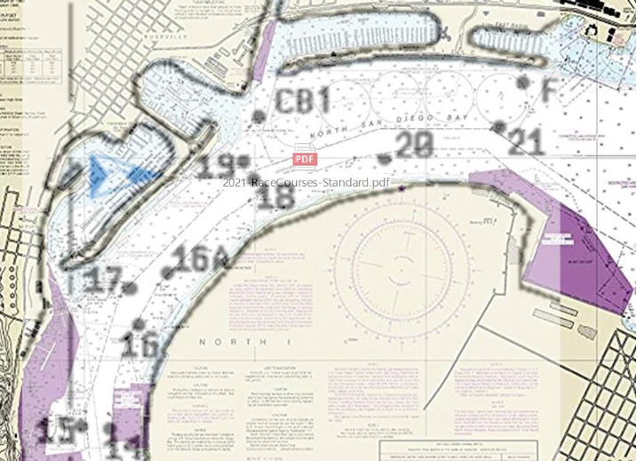

# Charts

Navigation Charts are something every sailor ought to be familiar with. If you own your own keelboat and plan to sail outside of your local sailing area, or want to know more about the area that you currently sail in then a local chart is essential. A Chart Book can be purchased that covers the local area and has the charts bound for convenient use. There are many symbols and abbreviations on a chart and getting familiar with some of them is important. The comprehensive reference is called Chart One and can be found at this link online.

[Chart One](https://msi.nga.mil/api/publications/download?key=16694005/SFH00000/ChartNo1.pdf&type=vie).

However charts will have applicable symbols and abbreviations printed on the chart for the area the chart covers. NOAA now offers custom printed charts with an application produced by ESRI.

CSSD sails in an area confined enough and with adequate visibility that a chart is not required.

