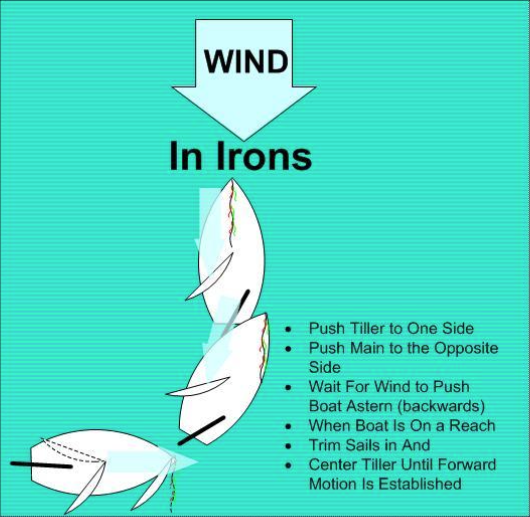

# Getting Out of Irons

You are “in irons” when your boat is stopped, you are headed directly into the wind with your sails luffing, and you are not able to steer normally.

## Practice

Start out “in irons.”

Push and hold the joystick completely to one side. **Be patient.** The boat will drift backward and slowly turn.

When the wind comes across the side of the boat, pull in both sheets push the joystick toward the boom, and resume sailing.

