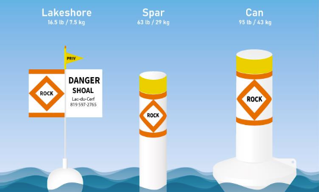

# Grounding

No, this is not referring to electricity rather the contact of your keel to the bottom. Do not test the depth beyond narrow channel markers by sailing past the line of buoys. In the channel leading to the CSSD docks the shore side beyond the buoys has a steel barrier and rocks just beneath the water. This barrier does not show until a very low tide.

Be wary of lee shored any change in water color should be met with suspicion and the prudent skipper will turn away towards deep water!

Due to the small size of our Martin 16s we do not carry anchors and our purpose does not include stopping anywhere but at our home docks so our participants and volunteers should focus on sailing the boats in deep water away from the shorelines.

