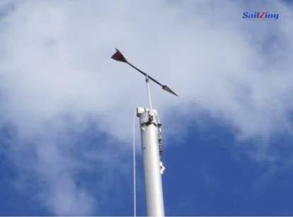

# Identifying Wind Direction

It is necessary to understand where the wind is coming from, in order to know which direction to head your boat, and how to trim the sails. These are some ways to determine wind direction:

Look at flags blowing in the wind.

Look at the telltales on the shrouds or the sails.

See which direction the wind vanes on nearby sailboats are pointing.

Notice the direction that the waves or ripples from wind gusts are moving on the water.

See that anchored boats face into the wind if the current is weak. Feel the wind on your face, and notice how your hair blows. Notice how other sailboats have their sails trimmed.

When the mainsail **fully** luffs, the wind blows from the mast to the end of the boom (toward the clew).

If you luff your sails and turn your boat until the boom is along the centerline of your boat, your bow will be pointing into the wind.

## Practice

Determine the wind direction while at the dock.

Then sail out into the bay, and again try to determine the wind direction.

## Remember

**Windward** means toward the wind. **Leeward** means away from the wind.

