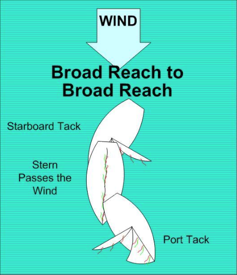

# Jibing

You jibe when you turn your boat _**away from **_ the wind, and the boom crosses quickly to the other side of the boat.

## Practice

Start sailing on a broad reach, with your sails perpendicular to the boat. Make sure the boom is at least 2 inches away from the wire shroud.

1. Say “READY TO JIBE” to let your companion know you what you are planning.
2. Check your surroundings for other boats.
3. Say “JIBING”, and start pulling in the mainsheet.

As soon as the boom crosses to the other side of the boat, let the mainsheet slide out rapidly until the boom is again about 2 inches off the shroud, and immediately center the joystick. Do not let the boom hit the shroud. The jib will switch sides without you tending the jib sheet.

## Hints

Pulling in the mainsheet and then letting it out lets you control the mainsail as it crosses the boat. Your companion can control the mainsheet from their position if needed.

“PREPARE TO JIBE” and “JIBE-HO” are sometimes used instead of “READY TO JIBE” and “JIBING”.

