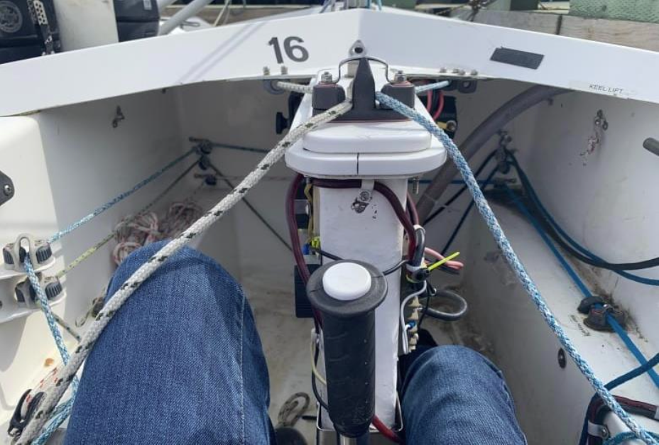
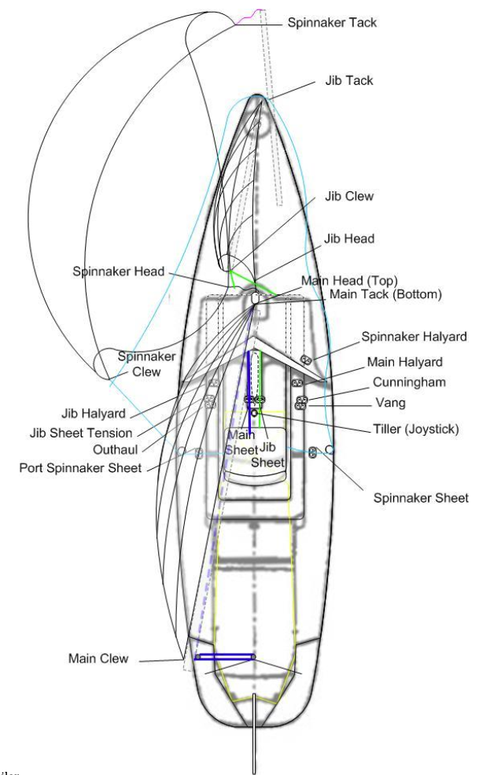

# Martin 16 Controls

Martin 16 sailors sit on a seat facing forward and all controls and lines are led to the cockpit to allow sailing without having to leave the seat. The rudder is controlled with a joystick. There is a second seat behind the command seat for a passenger or instructor. With the keel extended the boat cannot be tipped.

Once comfortably seated, the joystick tiller (to control the steering) and lines (to control the sails) are directly at hand making it possible to sail the boat independently without needing to change position. A second seat for an instructor or companion is located behind the sailor’s seat.

Optional power-assist equipment can be added to the boat to allow individuals with weak arms to sail the boat using a joystick similar to those found on power wheelchairs. And for those who cannot move their arms at all the sip ’n puff system allows them to sail the boat using their breath! Even people on respirators can sail the Martin 16 independently!

The Martin 16 is controlled by a deep, spade rudder which provides positive control under all wind and sea conditions, with minimum pressure required to the helm. The helmsperson uses a "joystick" to control the boat, and the movement of the joystick is transferred to the rudder via zero-stretch, high strength control lines guided by low-friction ball-bearing pulleys.

Below all the running rigging controls are illustrated, showing how all sail controls are led to the cockpit in easy reach of the sailor.

## Practice

Start once on the dock and you’ve found your boat. The participant should get into the front seat. Once the participant is onboard do the following:

- Release all the cleated lines inside the cockpit. Do not release the Spinnaker Halyard on the right just outside the cockpit and do not release the spinnaker sheets at the left and right shoulders on the Martin’s decks.
- Unclip the Vang and Cunningham from the bail on the Main/Jib cleats on the back/top of the Keel Trunk.
- The Companion can begin to attach the Jib Halyard, tack, and clew, then standing back while the Participant hoists the jib. Ensure the Jib Halyard is fully hoisted with enough tension to cause the forestay to become slack.
- Next the Companion can retrieve the boom with the Participants help and attach the tack and clew.
- While the Companion is working with the Main, the Participant can attach the Vang to the boom leaving it loose and uncleated.
- Next the Companion attaches the Main Halyard and guides the luff bolt rope into the mast’s sail slot while the Participant hoists the Main Halyard until the Mainsail is tugging on the boom.
- The Companion lifts the Boom and attaches it to the Gooseneck on the Mast while the Participant finishes hoisting the Main Halyard until there is some tension on the Mainsail’s Luff.
- With the Mainsail up the Participant can attach the Vang to the Boom and cleat off the Vang line then hand the Cunningham Hook to the Companion who attaches it to the Mainsail Cunningham Cringle about 8 inches above the Tack and the Participant then cleats the Cunningham line.
- At this point the Participant can set the Outhaul for the expected wind conditions and cleat it, check to see that the Jib Tension is cleated off and the Main and Jib Sheets are not cleated.
- The Companion can now untie and stow the Stern and Bow lines, climb aboard while Dock Assistant holds the Martin’s shroud, and the Participant checks that the tiller is free and clear by moving left and right.
- With the tiller free, the Dock Assistant walks the Martin to the end of the dock and pushes the boat forward so the Participant can steer.
