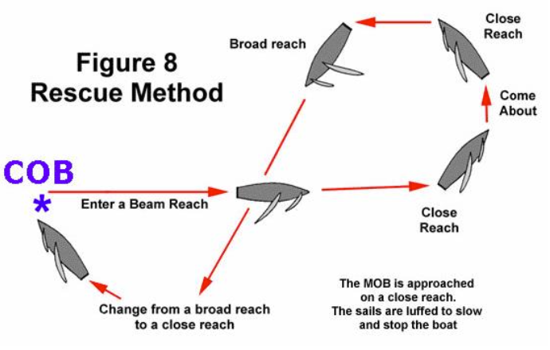

# Man Overboard (MOB) Drill

Rescuing a potential “Man Overboard” is an essential skill for any sailor to know. You can practice retrieving a lifejacket or buoy, or sail close to an anchored mark and pretend it is your person in the water.

## Practice

Start out sailing on any heading.

Throw the buoy overboard

Immediately say, “MAN OVERBOARD”.

Change your heading to a beam reach. _**Keep your eyes on your “MOB” buoy at all times.**_

After 5-10 seconds, tack and head again onto a beam or broad reach so you cross your “path”.

_**Head up**_, so you approach the “MOB” buoy on a close reach, and luff your sails so that your boat glides to a _**stop in the Safety Position.**_

Keep the “MOB” buoy to windward. Retrieve the “MOB.”

## Hint

This is called the _**Reach-Tack-Reach or Figure 8**_, which describes the procedure and pattern used.

In a real “Man Overboard” situation, you should call “MAN OVERBOARD” loudly as soon as you saw see the person in the water, and return as described. Always approach the MOB slowly! If you have difficulty reaching the person, or getting them in your boat, radio for help _**immediately**_ and try to flag down any other passing boat for assistance.

