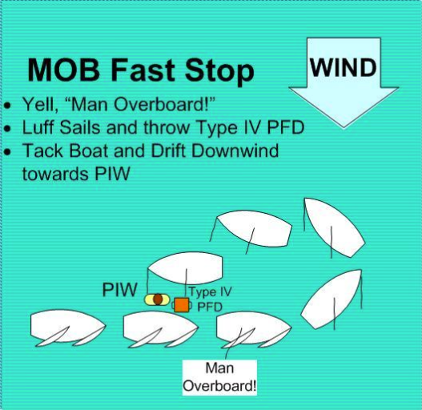

# Man Overboard (MOB) Drill “Adapted”

Rescuing a potential “Man Overboard” is an essential skill for any sailor to know. Most “Man Overboard” drills involve sailing away from the MOB briefly, then returning to where the person fell overboard. This drill is adapted for sailors who are not confident in their ability to return to the MOB. The goal is to stop the boat as soon as possible, so a person overboard can hopefully swim to the boat. You can practice the drill by retrieving a lifejacket or buoy, or sail close to an anchored mark and pretend it is your person in the water.

## Practice

Start out sailing on any heading.

Throw the buoy overboard.

Immediately say, “MAN OVERBOARD”. _**Keep your eyes on your MOB at all times.**_

Immediately release both the mainsheet and the jib sheet, and _**head**_ up directly into the wind. Then continue turning until you are on a close reach heading in _**Safety Position with your sails luffing completely.**_ You should glide to a stop.

Drift toward the MOB. Retrieve the buoy if possible.

In a real “Man overboard” situation, you should call “MAN OVERBOARD” loudly as soon as you see the person in the water, promptly release both the mainsheet and the jib sheet, and immediately start turning. If the person cannot reach the boat or you are unable to get them in your boat, radio for help **immediately**, and try to flag down any other passing boat for assistance.

