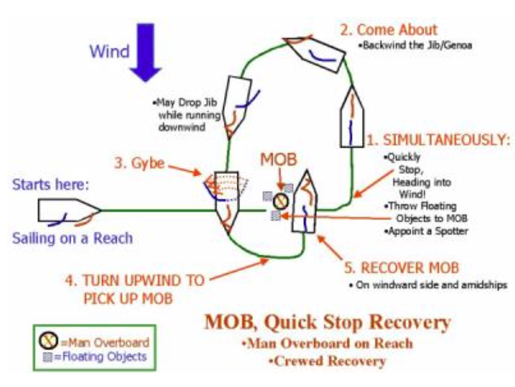

# Man Overboard Drill (Using Quickstop)

Man Overboard (MOB) is sometimes referred to as Crew Overboard (COB), and also sometimes as Person In Water (PIW). However, Man Overboard (MOB) is the term that is recognized universally among sailors.2

