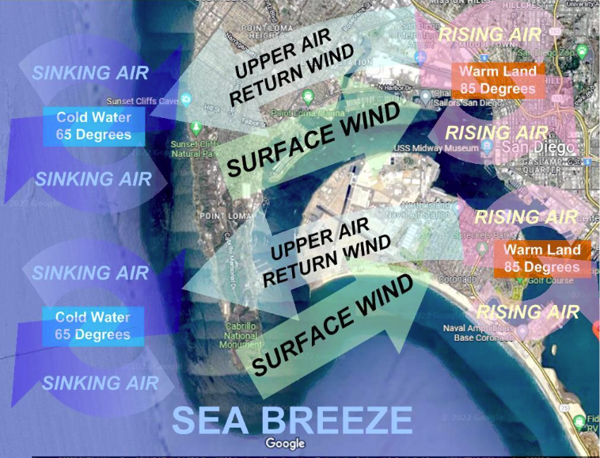

# Offshore and Onshore Winds

A sea breeze or onshore breeze is any wind that blows from a large body of water toward or onto a landmass; it develops due to differences in air pressure created by the differing heat capacities of water and dry land. As such, sea breezes are more localized than prevailing winds. Because land heats up much faster than water under solar radiation, a sea breeze is a common occurrence along coasts after sunrise. By contrast, a land breeze or offshore breeze is the reverse effect: dry land also cools more quickly than water and, after sunset, a sea breeze dissipates and the wind instead flows from the land towards the sea. Sea breezes and land breezes are both important factors in coastal regions' prevailing winds.

