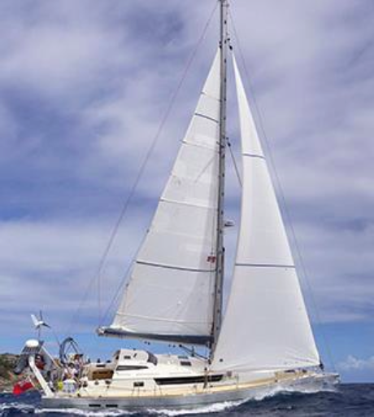

# Reefing

On most keelboats the mainsail can be made smaller by ‘reefing.’ This will reduce the sail area to depower the rig. On the Martin 16 reefing is unavailable, however the architect made the sail area of the Martin to withstand winds well above 20 knots. So, if the conditions seem to be exceeding the Martin 16’s ability, it is time to return to the dock or lower the mainsail and request a tow, albeit Challenged Sailors will always determine the conditions before allowing their boats to go out and if a small craft advisory (25 to 33 knots) are out of expected to be out during the sail, they will cancel sailing. In some cases, with participants or volunteers with less experience sailing may be curtailed when small craft exercise caution (winds of 15 to 19 knots) is announced.

If you are using a boat that can be reefed the rule of thumb is if you are considering weather to reef, then you should reef. This is especially true at the dock since reefing at the dock is safer than underway. Also remember that the mainsail in higher winds should have a snug foot wo ensure the reef also has a snug foot. Setting too much draft is counter to the objective of reefing which is to reduce sail area and while flattening the mainsail. Jibs on smaller boats can rarely be reefed unless they are on a roller furler and may develop too much draft when partially furled. Many clubs insist if you have too much wind while docking then drop the main and sail in on the jib.

For small boats without reef points on the main a method called a “Fisherman’s Reef” can be used. A Fisherman’s Reef involves easing the main until the top and leading edge of the sail begins to luff and while the leech is still catching wind. This takes some practice and skill but can be very helpful in reducing heel and preventing the boat from turning into the wind uncontrollably in higher winds and gusty conditions. As described by Herb Benavent on the web site [Rigging Doctor.com](RiggingDoctor.com): _A Fisherman's Reef is when you ease the mainsheet and sheet in the jib. This
will create a bubble in the main that will take away the mains power. This is a very temporary
fix that can help to depower the main during a blow._ [riggingdoctor.com alternatives to reefing](https://www.riggingdoctor.com/life-aboard/2016/2/10/alternatives-to-reefing)
