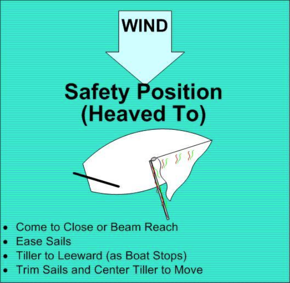

# Safety Position

The safety position allows you to take a brief, controlled rest from sailing. **Practice:**

Start out sailing on a close reach.

Ease the jib sheet and mainsheet until both sails are fully luffing.

Keep your boat on the close reach heading. Your boat will glide to a stop. You are now in the safety position.

To resume sailing, just trim in both sails, and the boat will start moving.

