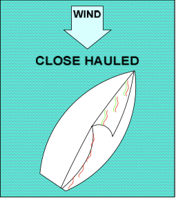

# Sail Close-Hauled Using Telltales

When sailing upwind, telltales help you determine how high you can point toward the wind, and still maintain your speed.

## Practice

Start sailing on a beam reach.

Head up toward the wind as you trim in (pull in) the jib to a position halfway between the mast and the shroud. Watch your jib telltales as you head up.

Return the joystick to center when both the red and green jib telltales fly straight back. Trim in the mainsail so the boom is directly over the leeward stern corner of the boat. You are now sailing close-hauled. Keep the telltales flying straight back as you sail.

If the _**inside**_ telltale flutters, then _**head down**_ by moving the joystick slightly to leeward (away from the wind). Then center the joystick when both telltales fly straight back.

If the _**outside**_ telltale flutters, _**head**_ up by moving the joystick slightly to _**windward**_ (toward the wind). Then center the joystick when both telltales fly straight back.

This heading will allow you to stay close to the wind and maintain good boat speed. If the wind is too strong, you can take some pressure off the joystick and flatten the boat on the water by letting out (easing) the mainsail a small amount.

**Hint:** Move the joystick _**away**_ from the direction of the fluttering telltales.

## Close Hauled

