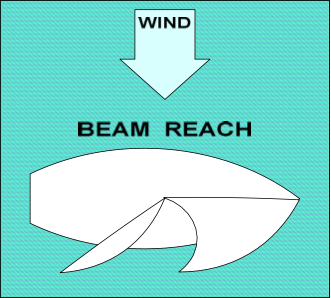

# Sail on a Beam Reach

You are on a beam reach when the wind is blowing perpendicular to your boat (directly across the side), and your sails are halfway out.

## Practice

Start sailing so that the wind blows perpendicular to the direction you are traveling.

Adjust the mainsail so it just starts to luff (flutter back and forth), and then trim in (pull in) slowly until the luffing stops. This gives you proper mainsail trim.

Adjust your jib so it just starts to luff, and then trim in slowly until the luffing stops. Then fine-tune with the telltales:

If, the **inside** telltale flutters up or down, trim in the sail gently until both telltales flow straight back.

If the **outside** telltale flutters up or down, let out (ease) the jib until both telltales fly straight back.

Steer a straight course, adjusting your sails as needed. If you need a short break from watching telltales, aim your sight over the bow of your boat to a spot onshore if possible, and head for that spot, checking the telltales periodically.

If the wind is too strong, you can take some pressure off the joystick and bring the boat more upright (reduce heel) by letting out (easing) the mainsail a small amount.

## Beam Reach

