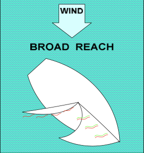

# Sail on a Broad Reach

You are on a broad reach when you are headed about 100°–140° from the wind, and your sails are about three-quarters of the way out.

## Practice

Start by sailing on a beam reach.

Head down (turn your boat away from the wind) while letting your mainsail out, until the wind comes over the windward stern corner of your boat.

Let out (ease) the mainsail until it just starts luffing, then gently trim it in until the luffing stops. Make sure the boom does not rub against the wire shroud. (The boom should always be at least 2 inches away from the shroud.)

Let out (ease) the jib until it just starts luffing, and then gently trim it in until the luffing stops. The jib telltales may not be effective when on a broad reach.

You are now sailing on a broad reach. Steer a straight course, keeping the wind over your windward stern corner and your sails full. Find a point on land to head for, if possible, to help you maintain a consistent heading.

## Hint

If your jib switches sides, you have headed down too far, and you are no longer on a broad reach. Head up by pointing the joystick gently to windward (away from the mainsail), until the jib is on the same side as the main. Then center the joystick.

## Broad Reach

