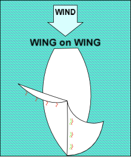

# Sail on a Run (Wing-On_Wing)

When sailing with the wind directly behind you, your sails catch the wind better if you have the jib on one side, and the mainsail on the other. This is called sailing downwind, or wing-on-wing.

## Practice

Start by sailing on a beam reach.

Head down (turn your boat away from the wind), while you let out (ease) your mainsail, until you are on a broad reach. The boom should be about 2 inches away from the wire shroud.
Let out (ease) the jib until it is perpendicular to the boat. The jib telltales will not be effective.

Gently move the joystick toward the boom, to turn the boat a bit more downwind. Return the joystick to center when the jib switches sides.

You are now sailing on a run. Steer a straight course, keeping the wind over your stern and your sails full. Find a point on land to head for, if possible, to help you maintain a consistent heading.

## Hint

This requires very careful steering. If you head too high toward the wind, your jib will switch sides. If you steer too far downwind, your mainsail will switch sides in an “accidental jibe”. If you do jibe accidentally, gently move the joystick toward the boom to jibe back onto your original course.

## Wing on Wing

