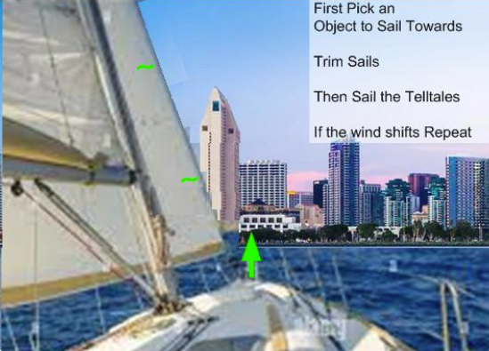

# Sailing a Straight Course

Every time you move the joystick, it slows the boat. Sailing a steady, straight course is easier, less tiring, and faster.

## Practice

Start sailing on a heading of your choice (pick an object on shore in front of your bow). Once you’ve picked a course, trim your sails to the wind.

Concentrate on trying to move the joystick as little as possible, while still maintaining your course. Focus on the feel of the boat as it responds to any small corrections that you make.

If a gust of wind makes the boat head up toward the wind, push the joystick slightly toward the boom to resist that movement. Ease up the pressure on the joystick as you feel the gust end.

After a few minutes, change your heading and sail trim. Notice if there is any difference in the movement needed on the joystick to maintain this new heading. Feel how the boat glides through the water.

## Hint

Movement with the joystick should be gentle and minimal. You are just trying to counteract the pressure of wind gusts and waves on the boat. Try not to over-steer.

