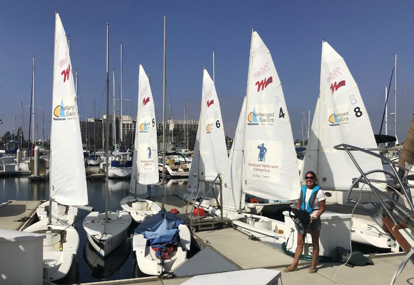

# Sailing Manual

This manual has been developed for people sailing in Martin 16 sailboats. Martin 16s have a jib boom and forward-facing seating, as well as a joystick to control steering. Some of the usual sailing instructions have been modified to suit the boats and the needs of various sailors.

Each lesson can be accomplished in about 10 to 15 minutes. More experienced sailors will be able to complete several of the first lessons quickly. It is strongly suggested that all lessons be done in order. Each lesson has been developed to build on the sailing skills and vocabulary discussed in previous lessons.

We hope you enjoy your day on the water, and find these sailing practice skill lessons informative and worthwhile!

By Jane Dunn 1/28/2016

Updated by E. Eric Matus 6/22/2022
