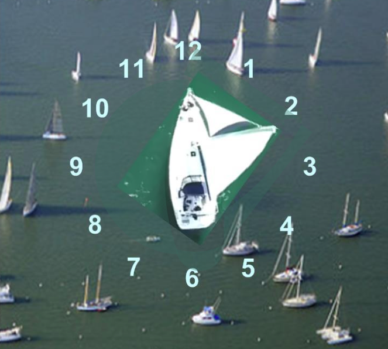

# Sailing Using Clock Positions

As sailors gain experience, they can have their companion use “clock positions” to give directions (see illustration the next page). This lets sailors trim sails and steer more accurately, and also helps them understand the movement of other boat traffic.

## Practice

Imagine that your boat is in the center of an analog clock face, with the 12 o’clock position straight ahead of the bow, and the 6 o’clock position directly behind your stern. The 3 o’clock position is directly to your right (starboard), and the 9 o’clock position is to your left (port).

Start sailing close-hauled on port tack, and _**have your companion check your surroundings for other boats**_. When your companion asks you to, change your heading so your boat points toward the 3 o’clock position.

Sail on this heading for about 15 seconds. After checking your surroundings, have your companion give a command to change to a 10 o’clock heading. (Remember, the 12 o’clock position is always the direction your boat is currently heading before you begin your maneuver).

Continue practicing steering and changing direction as your companion gives a variety of clock directions, until you become familiar with how much turning and sail trim is required for each change.

You can also practice having your companion tell you the location of other boat traffic using clock positions. For example, your companion can say, “There is a sailboat approaching us at 4 o’clock, about 50 yards away.” This allows you to orient yourself to traffic, and start preparing for any maneuvers that you may need to take to stay clear.

Your companion may also give directions by saying, “Our next racing mark is at 2 o’clock.”

If the companion gives clock position directions, and the jib sheets and mainsheet have been marked with whipping twine at the close-hauled, beam reach, and broad reach positions, then an experienced sailor with visual impairments will be able to sail with very little additional guidance.

_You may find yourself with experienced sailors **‘old salts’** that will use a combination of degrees off the Bow, Stern, or Beam, and terms such as forward quarter (roughly 45 degrees off the bow), Broad on the Beam (90 degrees from the Bow), or aft quarter (roughly 45 degrees ahead of the stern). As you continue to gain experience these directions will begin make sense._

