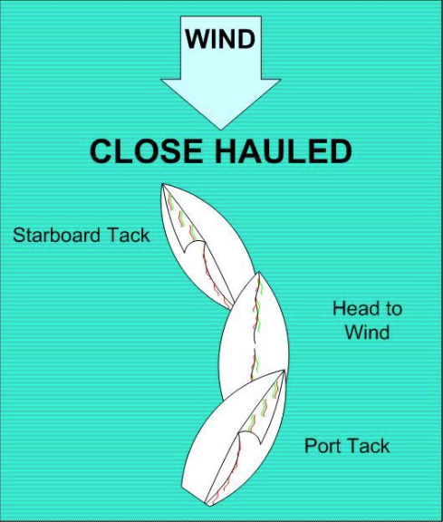

# Tacking (Coming About)

When you tack, you turn the boat _**into**_ the wind, through the 90° “No-Go Zone” until your sails cross to the other side of the boat.

## Practice

Start sailing on a close-hauled heading, with your sails trimmed to the correct position, and your telltales flying straight back.

1. Say “READY TO TACK?” to let your companion know you plan to change direction.
2. Check your surroundings for other boats, or have your companion check for you.
3. Say “TACKING”, and smoothly move the joystick all the way to windward. You do not have to
   adjust the sails. The sails will switch to the other side of the boat as your direction changes.
4. Center the joystick when your sails start to fill.
5. Check your telltales and adjust your heading as needed.
6. “READY ABOUT” and “HARD-TO-LEE” are sometimes used instead of “READY TO TACK” and
   “TACKING”.

