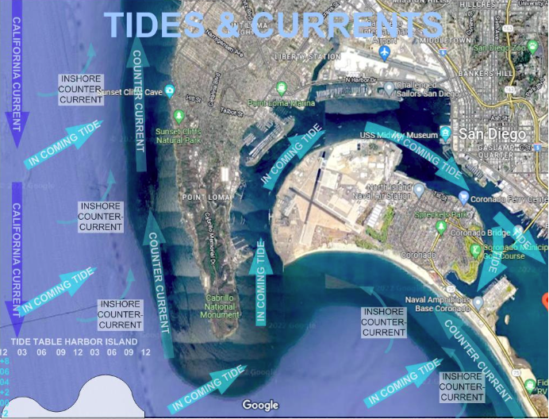

# Tides and Currents

In San Diego the Tides occur in a semi-diurnal cycle (twice a day) occasionally causing ‘King Tide’ currents up to 3 knots to flow in and out of San Diego Bay. Offshore the California Current transits from north to south at roughly .68 mph with diurnal fluctuations due to the tides. In addition there is a California Inshore Counter Current that moves north. These currents are responsible over centuries for the formation of the Silver Strand enclosing San Diego Harbor with sediments primarily from the Tijuana River.

Due to a strong north to south average wind circulating along the coast of California combined with the Earth’s Coriolis affect causes an upwelling current that brings nutrient rich water from the deep ocean to the surface along the California Coast. This is why the Gray Whales follow the Coastline to their breeding grounds along the Baja Peninsula rather than take the shorter direct route from their feeding grounds in Alaska.

The California Current and prevailing winds from the North contribute to a prolific yacht delivery business on the West Coast. Yacht owners enjoying sailing south downwind and down current but prefer to hire Captains to return their yachts north to their homeports.

